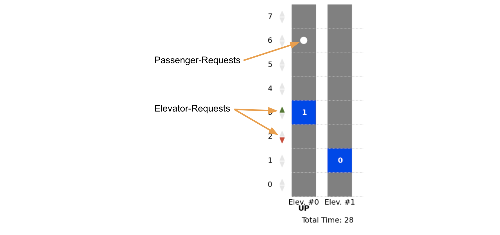

Observation Sensitive MCTS for Elevator Transportation
======================================================

We present a modification to the Monte-Carlo-TreeSearch (MCTS) approach used in AlphaZero, which incorporates
observed rewards in every step. Thereby we extend the applicability of the AlphaZero algorithm to tasks with observed rewards
at every step that feed directly into the final reward. We apply
this algorithm to one representative of this class, the elevator
transportation task, and show that our method is able to train
successfully on this task. Our method reaches performance close
to the collective-control heuristic.

Project Structure
-----------------

- More information about the Problem can be found in the [Final Report](./Final_Report.pdf)
- The main training procedure can be found in [train.py](./src/elevator_rl/train.py)
- Hyper-parameters can be set at [config.yaml](./src/elevator_rl/config.yaml),
use the environment variable "CONFIG_NAME" to choose a configuration
- The implementation of the model and learning algorithm can be found in the
[alphazero folder](./src/elevator_rl/alphazero)
- A detailed description of the environment we used can be found in the
[Documentation](./doc/environment.md), the implementation is in the
[environment folder](./src/elevator_rl/environment)
- In the [baseline folder](./src/elevator_rl/baseline) you can find baselines such as
random policy, pure MCTS, and the heuristic collective control
- If you want to play a little bit and control some elevators yourself you can run the
[interactive environment](./src/elevator_rl/environment/interactive_env.py)

Environment
-----------
We have implemented an elevator environment as visualized
below, which resembles the real world scenario closely
by only observing the passenger requests (up or down at a
specific floor), requested floors for elevators and the total
number of passengers in an elevator. Unobserved is e.g. how
many people are waiting at floors with a passenger request and how many passengers want to leave at requested floors.
To avoid those hidden states from leaking through the MCTS
exploration we represent them stochastically in our state.

